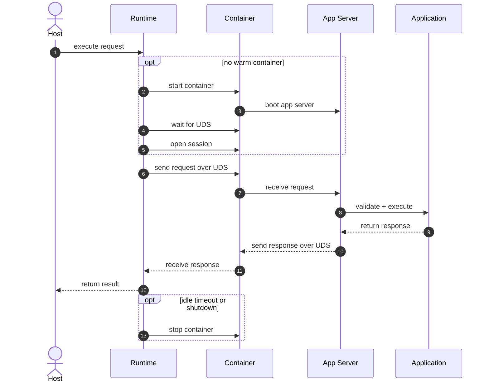

# OCIApp

OCIApp is a framework for building and running dependency-sandboxed Python applications using OCI artifacts.

## API Usage

OCIApp has 3 phases:
1. define an `Application`
2. building it as an `.ociapp` artifact with `ociapp-build`
3. and executing it with `Runtime.execute`.

### Define an application

```python
from ociapp import Application
from pydantic import BaseModel


class EchoRequest(BaseModel):
    value: str


class EchoResponse(BaseModel):
    value: str


class EchoApplication(Application[EchoRequest, EchoResponse]):
    async def execute(self, request: EchoRequest) -> EchoResponse:
        return EchoResponse(value=request.value)


app = EchoApplication()
```

### Build an artifact

Declare the build entrypoint in `pyproject.toml`:

```toml
[tool.ociapp-build]
entrypoint = "echo_app.main:app"
```

```bash
ociapp-build . --output-dir dist
```

### Execute an artifact

```python
from pathlib import Path

from ociapp_runtime import Runtime

async with Runtime() as runtime:
    response = await runtime.execute(
        Path("dist/echo-app-0.1.0.ociapp"), {"value": "hello"}
    )
```

See `example/echo-app` and `example/runtime_demo.py` for more detail.

## How it works

OCIApp encompases 3 packages. The `uv` workspace uses `ociapp-runtime` as the
root package, while `ociapp` and `ociapp-build` remain under `packages/`.

- `ociapp`: An SDK for defining arbitrary Python applications
- `ociapp-build`: A standalone CLI that builds `.ociapp` OCI archives via Docker Buildx
- `ociapp-runtime`: A library for implementing OCIApp Runtimes, which handle spinning up and managing a pool of application containers to fulfill execution requests.

`ociapp` exposes an `Application` class, which expects an implemention of an single `execute` method. It also includes the `ociapp serve` command, which `ociapp-build` uses as OCI artifact's ENTRYPOINT; it spins up a UDS server that listens for, and responds to, execution requests by actually invoking `.execute`.

`ociapp-runtime` primarily implements the `Runtime`, which:
- exposes a simple `.execute` interface for running the `execute` of a provided OCI artifact with a given request payload.
- a warm pool of application containers, which it manages by spinning up new ones as needed and tearing down idle ones.
- a UDS client for every active application container.

## Request Flow



## TODO

1. Decouple `Runtime` ownership from `execute` so that the runtime can exist on a separate host
    - a `LocalExecutor` for when the runtime exists on the same machine
    - a `RemoteExecutor` for when the runtime is decoupled
2. Refactor `Runtime` and `Engine` to:
   - support local on-machine docker via `LocalEngine`
   - a `K8Engine` to support a node-local `DaemonSet` that spins up K8 containers.
